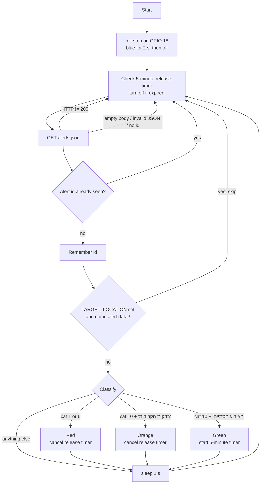

# miklat-alert

[](LICENSE)

Visual alert indicator for the Israeli Home Front Command (Pikud HaOref) Red Alert system, built for a **Raspberry Pi Zero** with a WS2812B (NeoPixel) LED strip.

A small Python script (`redalert.py`) polls the Home Front Command's public alerts feed and lights up an LED strip, so you can see the current status at a glance, for example next to the door of a shelter (*miklat*). It runs as a systemd service and can filter alerts for a single city or area.

> [!WARNING]
> **This is not an official alerting system and must not be relied on for life safety.**
> It depends on an undocumented web feed, your internet connection, your power supply and a hobby script, and any of them can fail silently.
> Always use the **official Home Front Command app**, the official website and the outdoor **sirens** as your source of alerts, and follow the Home Front Command's instructions.
>
> This project is **unofficial** and is **not affiliated with, endorsed by or connected to** the Israeli Home Front Command (Pikud HaOref), the IDF or any government body.

---

## Table of Contents

- [Features](#features)
- [LED Status Colors](#led-status-colors)
- [How It Works](#how-it-works)
- [Hardware Requirements](#hardware-requirements)
- [Wiring](#wiring)
- [Software Requirements](#software-requirements)
- [Installation](#installation)
- [Configuration](#configuration)
- [Running](#running)
- [Logging](#logging)
- [Troubleshooting](#troubleshooting)
- [Known Issues and Limitations](#known-issues-and-limitations)
- [Security Notes](#security-notes)
- [Contributing](#contributing)
- [License](#license)

---

## Features

- Polls the Home Front Command alerts feed (`alerts.json`) continuously.
- Drives a WS2812B / NeoPixel strip through the `rpi_ws281x` library on GPIO 18 (PWM).
- Distinguishes between an **active alert**, a **pre-alert** ("in the coming minutes") and an **event ended** (all-clear) message.
- Optional filter for a single city/area (`TARGET_LOCATION`), matched against the alert's location list.
- Handles each alert ID only once, with a bounded list of seen IDs (`MAX_IDS`).
- Blue self-test on start-up, so you can check the strip works.
- All-clear (green) turns itself off after 5 minutes.
- Logs every handled event with [loguru](https://github.com/Delgan/loguru); the output ends up in the systemd journal.
- Ships with a systemd unit that starts the script at boot and restarts it if it stops.

---

## LED Status Colors

All LEDs on the strip show the same color.

| Color | RGB | Meaning | How long it stays on |
|-------|-----|---------|----------------------|
| 🔵 Blue | `(0, 0, 255)` | Start-up self-test | 2 seconds, then off |
| 🔴 Red | `(255, 0, 0)` | Active alert (category `1` or `6`) | Until a pre-alert, an all-clear or another alert changes it |
| 🟠 Orange | `(255, 80, 0)` | Pre-alert: category `10` with `בדקות הקרובות` ("in the coming minutes") in the title | Until an alert or an all-clear changes it |
| 🟢 Green | `(0, 255, 0)` | All-clear: category `10` with `האירוע הסתיים` ("the event has ended") in the title | 5 minutes, then off |
| ⚫ Off | – | Idle / no active alert | – |

Category `1` is the missile/rocket alert and category `6` is the hostile aircraft intrusion alert in the Home Front Command feed (the original README also labelled these as "rocket / hostile aircraft"). <!-- TODO: verify category meanings against the current Oref feed -->
All other categories (and category `10` messages with other titles) are ignored and don't change the LEDs.

The brightness is fixed at `65` out of `255` (about 25 %).

---

## How It Works



If the request or parsing raises an exception, the error is logged and the script also sleeps 1 second before polling again.

1. **Start-up.** The strip is initialized (15 LEDs, GPIO 18, 800 kHz, DMA 10, PWM channel 0, brightness 65), shows blue for 2 seconds, then turns off.
2. **Polling.** The script sends a `GET` request to
   `https://www.oref.org.il/WarningMessages/alert/alerts.json`
   with these headers, which mimic the Home Front Command website:

   | Header | Value |
   |--------|-------|
   | `Referer` | `https://www.oref.org.il/` |
   | `User-Agent` | `Mozilla/5.0 (Windows NT 10.0; Win64; x64)` |
   | `X-Requested-With` | `XMLHttpRequest` |

3. **Parsing.** Non-200 responses are logged as errors. An empty body (the normal "no alert" state), invalid JSON, or a JSON object without an `id` is ignored. From a valid alert it reads `id`, `cat`, `title` and `data` (the list of locations).
4. **De-duplication.** Each alert ID is handled once. The list of seen IDs is cleared when it reaches `MAX_IDS` entries.
5. **Location filter.** If `TARGET_LOCATION` is set, the alert is handled only if that exact string appears in the alert's `data` list. Otherwise it is logged and skipped.
6. **Classification and LEDs.** The alert is mapped to red, orange or green as described in [LED Status Colors](#led-status-colors). A red or orange event cancels a running release timer; a green event starts a 5-minute timer, and the LEDs turn off when it expires.
7. **Loop.** After an alert that passes the de-duplication and location checks (whether or not it changes the LEDs), or after an error, the script waits 1 second and polls again. See [Known Issues](#known-issues-and-limitations) for the cases where it doesn't wait.

---

## Hardware Requirements

- Raspberry Pi Zero (W / WH / 2 W). Other Raspberry Pi models supported by `rpi_ws281x` should also work.
- WS2812B (NeoPixel) LED strip, 15 LEDs by default (see `LED_COUNT`).
- 330 Ω resistor on the data line.
- 5 V power supply adequate for the strip.
- Jumper wires.
- Optional but recommended: a 1000 µF capacitor across the strip's power input, and a 3.3 V to 5 V level shifter (for example a 74AHCT125) on the data line.

---

## Wiring

### Pin table

| Raspberry Pi pin | Physical pin | Connects to |
|------------------|--------------|-------------|
| GPIO 18 (PWM0) | 12 | 330 Ω resistor → strip **DIN** |
| GND | 6 (or any GND) | Strip **GND** and the power supply's **−** |
| 5 V | 2 or 4 | Strip **+5V** (only for short strips, see below) |

### Diagram

```
   Raspberry Pi Zero                      WS2812B LED strip
  ┌────────────────────┐                ┌──────────────────┐
  │ GPIO 18 (pin 12) ──┼──[ 330 Ω ]─────┼─ DIN             │
  │ GND     (pin 6)  ──┼────────┬───────┼─ GND             │
  └────────────────────┘        │   ┌───┼─ +5V             │
                                │   │   └──────────────────┘
                                │   │
                          ┌─────┴───┴──────┐
                          │ 5 V supply     │
                          │  (−)     (+)   │
                          └────────────────┘

  The GND of the Pi, the strip and the power supply must be connected together.
```

> **Note:** The 330 Ω resistor goes between **GPIO 18** and the strip's **DIN** (data-in) pin. It protects the data line from voltage spikes and reduces ringing.

### Power notes

- Each WS2812B LED draws up to ≈ 60 mA at full white and full brightness. 15 LEDs can therefore draw up to ≈ 0.9 A.
- The script uses a brightness of 65/255 and single, mostly one-channel colors (red, green, blue; orange mixes red with a little green), so the real draw of the default 15-LED strip is much lower (roughly 0.1 A).
- For more than a handful of LEDs, or if you raise `LED_BRIGHTNESS` or `LED_COUNT`, power the strip from an **external 5 V supply** and connect its ground to the Pi's GND. Don't power a long strip through the Pi's 5 V pins.
- The Pi's GPIO outputs 3.3 V, while WS2812B strips expect a data signal close to 5 V. Many strips work without a level shifter, but if the LEDs flicker or show wrong colors, add one.

---

## Software Requirements

- Raspberry Pi OS (or another Linux distribution for the Pi) with Python 3 at `/usr/bin/python3` (the path used by the service file).
- Root access (the WS281x driver needs direct access to the PWM/DMA hardware).
- Internet access to `www.oref.org.il`.
  <!-- TODO: verify whether the Oref alerts feed is geo-restricted to Israeli IP addresses; nothing in the code indicates it either way -->

Python packages (from [`requirements.txt`](requirements.txt), unpinned):

| Package | Used for |
|---------|----------|
| `rpi_ws281x` | Low-level WS281x LED driver (`Adafruit_NeoPixel`, `Color`), used by the script |
| `loguru` | Logging, used by the script |
| `requests` | Pulls in `urllib3`, which the script uses for HTTP requests |
| `adafruit-circuitpython-neopixel` | CircuitPython NeoPixel library (listed, but not imported by the script) |
| `adafruit-blinka` | CircuitPython compatibility layer for Raspberry Pi (listed, but not imported by the script) |

---

## Installation

### 1. Prepare the Pi

```bash
sudo apt-get update && sudo apt-get upgrade -y
sudo apt-get install -y python3 python3-pip git
```

### 2. Clone the repository

The service file expects the code in `/opt/redalert`:

```bash
sudo git clone https://github.com/t0mer/miklat-alert.git /opt/redalert
cd /opt/redalert
```

### 3. Install the Python dependencies

The service runs as root with the system Python, so install the packages for root:

```bash
sudo pip3 install -r requirements.txt
```

On Raspberry Pi OS Bookworm and newer, `pip` refuses to install into the system Python (`externally-managed-environment`). See [Troubleshooting](#troubleshooting).

### 4. Free the PWM hardware (disable onboard audio)

GPIO 18 drives the strip through the Pi's PWM hardware, which the onboard analog audio also uses. If audio is enabled, the LEDs may flicker or not work. Disable it in the boot config (`/boot/firmware/config.txt` on Bookworm, `/boot/config.txt` on older releases):

```ini
dtparam=audio=off
```

SPI is **not** needed when you use GPIO 18 (PWM). It is only used when the strip is driven from GPIO 10.

Reboot after the change:

```bash
sudo reboot
```

---

## Configuration

### Environment variables

| Variable | Default | Description |
|----------|---------|-------------|
| `TARGET_LOCATION` | *(empty: all locations)* | Hebrew city/area name to filter alerts for, e.g. `רעננה`. Must match an entry in the alert's location list exactly (leading/trailing spaces are trimmed). Only one location is supported. |
| `MAX_IDS` | `1000` | Number of alert IDs to remember before the seen-IDs list is cleared. |
| `RESPONSES_DIR` | `responses` | Read by the script but not used. |

Set them in the systemd service file (see [below](#installing-as-a-systemd-service)) or export them before a manual run:

```bash
export TARGET_LOCATION="רעננה"
```

> **Tip:** Location names in the feed are the Home Front Command's alert-area names, which can be more specific than a city name (large cities are split into several areas). Use the exact spelling from the feed.

### LED strip constants (in `redalert.py`)

These are hard-coded; edit the script to change them.

| Constant | Default | Description |
|----------|---------|-------------|
| `LED_COUNT` | `15` | Number of LEDs on the strip |
| `LED_PIN` | `18` | GPIO pin (GPIO 18 uses PWM) |
| `LED_FREQ_HZ` | `800000` | LED signal frequency in Hz |
| `LED_DMA` | `10` | DMA channel |
| `LED_BRIGHTNESS` | `65` | Brightness, 0–255 |
| `LED_INVERT` | `False` | Invert the signal (for an inverting level shifter) |
| `LED_CHANNEL` | `0` | PWM channel |
| `RELEASE_TIMEOUT_SECONDS` | `300` | How long the green all-clear stays on |

---

## Running

### Manual test

```bash
sudo python3 /opt/redalert/redalert.py
```

> `sudo` is required because the WS281x library needs root access to the GPIO/PWM hardware.

The strip should light up blue for 2 seconds and then turn off. Stop the script with <kbd>Ctrl</kbd>+<kbd>C</kbd>.

### Installing as a systemd service

Copy the provided service file and enable it:

```bash
sudo cp /opt/redalert/redalert.service /etc/systemd/system/
sudo systemctl daemon-reload
sudo systemctl enable redalert.service
sudo systemctl start redalert.service
```

Check the status:

```bash
sudo systemctl status redalert.service
```

### Service file reference

The included `redalert.service` runs the script **as root** from `/opt/redalert`, waits for network connectivity, stops it with `SIGINT` and restarts it whenever it exits (`Restart=always`):

```ini
[Unit]
Description=Red Alert
After=network-online.target
Wants=network-online.target systemd-networkd-wait-online.service
StartLimitIntervalSec=5
StartLimitBurst=5

[Service]
KillSignal=SIGINT
WorkingDirectory=/opt/redalert
Type=simple
User=root
ExecStart=/usr/bin/python3 /opt/redalert/redalert.py
Restart=always

[Install]
WantedBy=multi-user.target
```

To filter for a specific location, add an `Environment` line under `[Service]`, then run `sudo systemctl daemon-reload && sudo systemctl restart redalert.service`:

```ini
Environment="TARGET_LOCATION=רעננה"
```

---

## Logging

The script logs with loguru's default settings: to stderr, at `DEBUG` level and above. Under systemd, the output goes to the journal:

```bash
sudo journalctl -u redalert.service -f
```

What gets logged:

| Level | Message |
|-------|---------|
| INFO | `Monitoring alerts` and the active location filter at start-up |
| INFO | `on_alert` / `on_pre_alert` / `on_release` with the alert ID, category and title |
| INFO | Alerts skipped because `TARGET_LOCATION` isn't in their location list |
| INFO | Release timer started, cancelled or expired |
| INFO | `Clearing seen_ids list to save memory` |
| ERROR | `HTTP error <status>` for non-200 responses |
| ERROR | `Exception occurred: ...` for network or other errors (the loop keeps running) |
| DEBUG | `Ignoring invalid or empty JSON response` |

---

## Troubleshooting

| Symptom | Likely cause and fix |
|---------|----------------------|
| No blue flash at start-up | Check the wiring (DIN, common GND, 5 V), make sure the script runs as root, and disable onboard audio (see [step 4](#4-free-the-pwm-hardware-disable-onboard-audio)). |
| LEDs flicker or show the wrong colors | Missing common ground, a weak power supply, or a 3.3 V data signal that is too low for the strip. Add a level shifter and a capacitor. |
| `externally-managed-environment` when running `pip3 install` | Raspberry Pi OS Bookworm blocks system-wide pip installs. Either install with `sudo pip3 install --break-system-packages -r requirements.txt`, or create a virtual environment and change `ExecStart` in the service file to that environment's `python3`. |
| Journal shows repeated `HTTP error <status>` | The feed is rejecting or blocking the request. Check that the Pi can reach `https://www.oref.org.il` from its network. <!-- TODO: verify whether non-Israeli IPs are blocked --> |
| Journal shows `Exception occurred: ...` | Usually a network problem (DNS, no connectivity). The script keeps retrying. |
| Alerts are logged as `ignored, target location not found` | `TARGET_LOCATION` doesn't exactly match the location string in the feed. Copy the exact name from the logged location list. |
| The service stops and doesn't come back | `StartLimitBurst=5` in `StartLimitIntervalSec=5`: if the script crashes 5 times within 5 seconds (for example at import time), systemd gives up. Check `journalctl -u redalert.service`, fix the cause, then run `sudo systemctl reset-failed redalert.service && sudo systemctl start redalert.service`. |
| LEDs stay on after the service is stopped | Known issue; see below. |

---

## Known Issues and Limitations

- **No wait after most loop iterations.** The 1-second `time.sleep(1)` sits after the `try` block, and the `continue` statements (empty response, invalid JSON, already-seen ID, location mismatch, non-200 status) skip it. In the normal idle state (empty response) the script therefore polls the feed back-to-back with no delay.
- **Red and orange don't time out.** They stay on until another handled event (alert, pre-alert or all-clear) arrives. If the all-clear is missed, for example because of a network outage or a location filter mismatch, the LEDs stay red or orange until the next event.
- **LEDs aren't turned off on stop.** The service stops the script with `SIGINT`, which raises `KeyboardInterrupt`; the script only catches `Exception`, so the strip keeps its last color after the service is stopped or after <kbd>Ctrl</kbd>+<kbd>C</kbd>.
- **Only one location** can be filtered, and it must be an exact match.
- **Seen-ID reset.** When the seen-IDs list reaches `MAX_IDS`, it is cleared completely, so an alert still present in the feed may be handled again.
- **Hard-coded LED settings.** Pixel count, pin and brightness can only be changed by editing the script.
- **No network-failure indication.** If the feed can't be reached, the LEDs don't show it; the error is only logged.
- `requirements.txt` isn't pinned and lists packages the script doesn't import (`adafruit-circuitpython-neopixel`, `adafruit-blinka`), while the directly imported `urllib3` only comes in through `requests`.
- The `RESPONSES_DIR` setting is read but not used.
- The feed is an undocumented endpoint of the Home Front Command website; its format or access rules can change without notice.

---

## Security Notes

- The service runs as **root** (`User=root`), because the `rpi_ws281x` driver needs direct access to the PWM/DMA hardware. Keep the Pi updated, change the default password, disable services you don't need, and don't expose it to the internet.
- Only root should be able to write to `/opt/redalert`, since the code there runs as root at every boot.
- The script only makes outbound HTTPS requests to `www.oref.org.il`. It doesn't open any listening ports and uses no credentials or API keys.

---

## Contributing

Issues and pull requests are welcome. Please keep changes small and focused, test them on real hardware, and describe the wiring you used.

---

## License

This project is licensed under the [Apache License 2.0](LICENSE).
